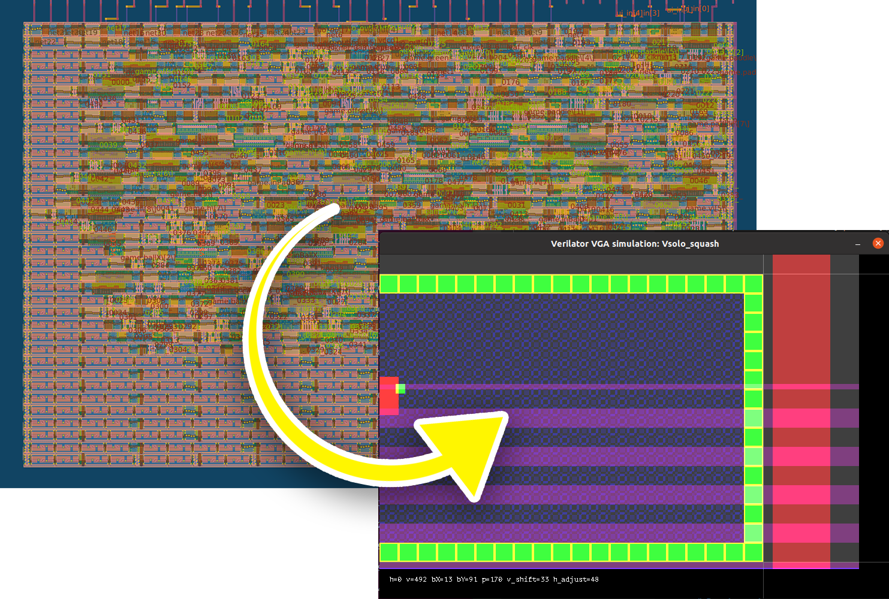

   

> Note: this is an experimental repo for Tiny Tapeout 03p5 (3.5).
> It is essentially a fork of the experimental template:
> [tt03p5-submission-template](https://github.com/TinyTapeout/tt03p5-submission-template).
> Please talk to the Tiny Tapeout team before using it!

# "Solo Squash" TT03p5 submission

This is a minimalistic VGA "game" implemented in Verilog as a 1x1 "tile" submission to the experimental
Tiny Tapeout 03p5 Caravel project, destined to be made into an ASIC via the chipIgnite 2306Q shuttle.

The design itself is digital logic that implements a 640x480 VGA driver that allows one person to play
a super simple Pong-like game of bouncing a ball off a paddle and around 3 walls.

**A much more detailed run-down of the design is found in the [`solo_squash` repo](https://github.com/algofoogle/solo_squash).**

For more info about my previous Tiny Tapeout submission attempt, including a discussion of a bit of the
testing and local build process, see: [`anton1-tt03`](https://github.com/algofoogle/anton1-tt03)

**NOTE:** There is an extra feature in this design which is just an experiment: I've included a
leading zero counter with a 24-bit input that comes from the concatention of these internal
signals of the solo_squash module: `{offset[3:0],v,h}` -- It outputs the count
(from 0 to 24) on `uio_out[4:0]`, and also sets `uio_out[5]` if the count is 24
(i.e. "all zeroes" signal).

## How it works

### What is Solo Squash?

A 25MHz clock drives a simple 640x480 VGA generator, and in turn generates a simple "game"
that displays a bouncing ball within a playfield of 3 walls, with the 4th side open except
for a lone paddle that you as the player control. Pong? What's that?
Sounds too new-fangled for me!

### What's the objective of the game?

Keep the ball bouncing in the playfield for as long as you can. Sometimes it's harder than it sounds!
There is no score, and no other objective. It's educational, and offers mild thrills,
just like Edna.

One button moves the paddle up, the other down, at a constant rate.

Bounces off the walls produce a simple tone, and off the paddle produce a slightly different tone.
Letting the ball escape will humiliatingly drone on for a bit before the ball returns to play.

A hint: Let the drifting blue background pattern be your guide for where the ball will
ultimately end up as it bounces around.

### How does the design work?

Tones produced on `speaker` are derived from divisions (bits) of the vertical scan register.

Rendering of the walls, ball, and paddle are done using registers (more-so than combo logic)
that turn the VGA red/green channels on and off at the right times as the VGA beam marches on.
The blue background pattern is done with bitwise logic from the horizontal and vertical scan
counters, with another counter to create the drifting effect by applying an offset.

Detecting when a bounce happens is done by detecting if any pixel we're rendering coexists
in the ball and wall (or paddle). Long tone and ball return is actually just an accidental
side effect of counters rolling over, but that's good enough for me!

## How to test

See [doc/testing.md](./doc/testing.md) for information on how to test the ASIC, as well as how to run visual simulation with Verilator.

# What is Tiny Tapeout?

TinyTapeout is an educational project that aims to make it easier and cheaper than ever to get your digital designs manufactured on a real chip!

Go to https://tinytapeout.com for instructions!

## Resources

* [FAQ](https://tinytapeout.com/faq/)
* [Digital design lessons](https://tinytapeout.com/digital_design/)
* [Learn how semiconductors work](https://tinytapeout.com/siliwiz/)
* [Join the community](https://discord.gg/rPK2nSjxy8)

## What next?

* Share your GDS on Twitter, tag it [#tinytapeout](https://twitter.com/hashtag/tinytapeout?src=hashtag_click) and [link me](https://twitter.com/matthewvenn)!
