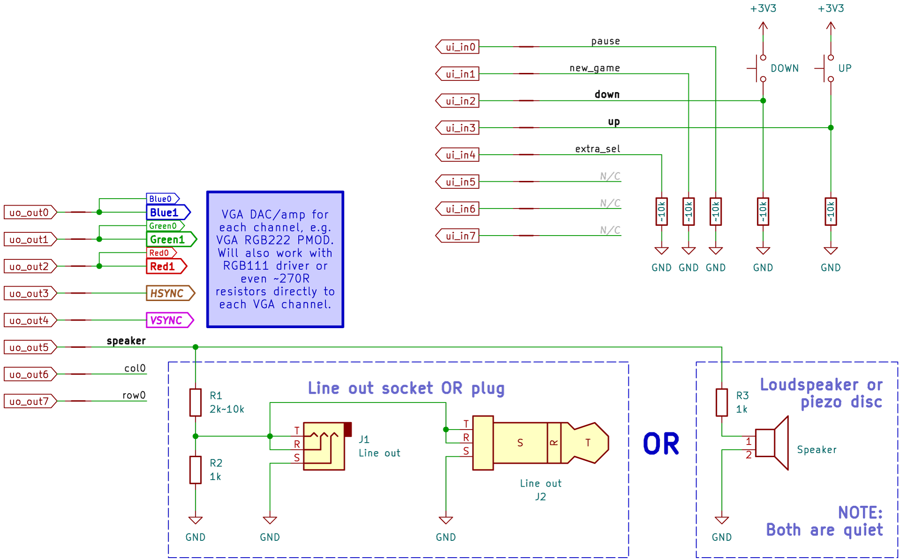
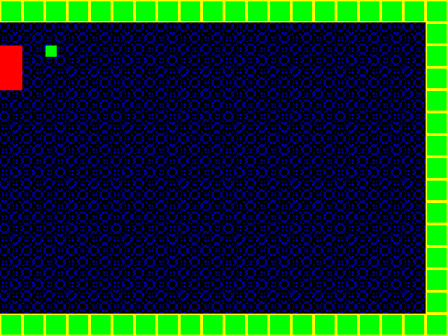

# How to test tt03p5-solo-squash

*   [Testing the ASIC](#testing-the-asic)
*   [Testing the ASIC using tt3p5 MicroPython SDK](#testing-the-asic-using-tt3p5-micropython-sdk)
*   [Testing by Verilator simulation](#testing-by-verilator-simulation)

## Testing the ASIC

The ASIC was recently manufactured, and the Tiny Tapeout team will be doing a bring-up very soon.

### TL;DR: Quick hook-up and demo

This will allow you to demo the essential features (VGA out, sound out, and button inputs) and actually play the game:



Quick notes about what you see above:

*   **Clock**:
    *   25.175MHz ideal. Anything from 21MHz to 30MHz should work.
*   **VGA out**:
    *   5 simple signals: HSYNC, VSYNC, and 1 digital output each for Red, Green, Blue channels.
    *   If using a PMOD (VGA DAC/amp) with (say) 2 bits per channel, you can double-up each of R, G, B for full contrast.
    *   If wiring *directly* to your display, I suggest an in-line 270&ohm; resistor for each signal to get correct levels, but beware: This could source ~10mA per IO, which might be well over the [Caravel limit](https://skywater-pdk.readthedocs.io/en/main/contents/libraries/sky130_fd_io/docs/user_guide.html#i-o1-common-features).
*   **Button inputs**:
    *   Active-high, hence weakly pulled low otherwise.
    *   Most important are `UP` and `DOWN`. Others are pulled low as non-essential, but they can be active-high buttons too.
    *   Debouncing is not required on inputs; they have 2xDFF sync internally, and they are not edge-sensitive.
*   **Speaker**:
    *   Choose: (a) tiny speaker/passive-piezo driven directly at low volume; OR (b) line-out for use with any regular audio amplifier, e.g. PC line-in or portable speaker 'aux' input.
*   Bidirectional pins are not shown; they're all configured as outputs but their functions are not overly important for demo.

That's enough to get started. From power-on, a display should be visible resembling the screenshot below.

> [!TIP]
> It's not necessary to assert reset, but without it you might find that the paddle 'overflows' and fills the full height of the left edge.

> [!NOTE]
> Not working? See [Diagnosing issues](#diagnosing-issues).




These are the main features you should observe:

*   3 walls: top, right, and bottom of screen.
*   Red paddle. Moved up and down by buttons. This is your 'player'.
*   Green ball which moves constantly and bounces off the objects listed above.
*   Scrolling patterned blue background. Just decoration.
*   When the ball touches anything it should play a tone via `uo_out5`.
*   If you miss the ball and it goes offscreen, you'll hear a longer tone, and then the ball should return to play after a couple of seconds.

If you want, see [pin descriptions](https://github.com/algofoogle/tt03p5-solo-squash/blob/163eb866e6f9eb7d51b215f075e0b5d8e652645a/info.yaml#L116-L145).


### Additional/advanced stuff to test

1.  Holding a high on `ui_in[0]` ("pause") will freeze all animation, and holding a high on `ui_in[1]` ("new_game") will revert the game to its starting state while the background scrolling animation continues.
2.  `uo_out[6]` is `col0` and is a single pulse (one clock period wide) that occurs every 800 clocks -- i.e. it is asserted during the first pixel of every line.
3.  `uo_out[7]` is `row0` and is a single pulse (800 clocks wide) that occurs every 420,000 clocks -- i.e. it is asserted during the first line of every frame.
4.  You could trigger an oscilloscope on the rising edge of `row0` and see the single clock pulse occurring on `col0` at the same time.
5.  `bidir[5:0]` are the output of a '24-bit leading zero counter' test that behaves like a *mostly* logarithmic down-counter that rolls over every 16 frames. An oscilloscope should show stretching pulses on `bidir[0]`, repeating every ~267ms. `bidir[5]` is the 'input is all 0' flag.
6.  `bidir[6]` is `debug1` and by default it outputs the *un*registered green signal. Likewise, `bidir[7]` (`debug2`) is unregistered red. You could swap out one or both of `uo_out[2:1]` for these and you should see that they change 1 pixel ahead of their respective registered versions.
7.  If `ui_in[4]` is *high*, then the outputs of `bidir[7]` and `[6]` change to unregistered blue and the "visible" flag respectively.


### Diagnosing issues

If you get a display but the ball is not moving:
*   `ui_in[1]` (`new_game`) might be high if the background is moving.
*   `ui_in[0]` (`pause`) might be high if the background is NOT moving.

If you don't get a display at all, check:
*   ~31.5kHz (88% duty cycle) on `uo_out[3]` (HSYNC).
*   ~60Hz (99.6% duty cycle) on `uo_out[4]` (VSYNC).
*   Is there any signal on any of `uo_out[2:0]` (i.e. RGB)?
*   Are there any speaker tones or audio-frequency waveforms on `uo_out[5]`?
*   Does a different clock speed work? Try from 20MHz up to 32MHz.
*   Do the *un*registered outputs (`bidir[7:6]`) produce a video image?
*   Is there any activity on `bidir[5:0]`? These are part of a 'leading zero counter' test that behaves like a *mostly* logarithmic counter that rolls over every 16 frames.

Additionally, while clocking the design held in reset, it should assert the following outputs:
*   `uo_out[7:0]`: `11011110`
*   `bidir[7:0]`: `11111000`


## Testing the ASIC using tt3p5 MicroPython SDK

> [!TIP]
> This is based on: https://github.com/TinyTapeout/tt-micropython-firmware/blob/main/README.md and **NOTE** that this code was written to work with [commit ab28d73](https://github.com/TinyTapeout/tt-micropython-firmware/commit/ab28d73c710e8b6528898d3eaed8d5c95ad42198) of that repo/library, after it had been refactored a bit.

Below is my attempt at a scripted test that should work with TT03p5 to test this design.

### `config.ini`

First, we use the [`config.ini`](../test/tt-demo-board/config.ini) file to tell the test library what our defaults and start-up conditions are for this tt03p5-solo-squash (`tt_um_algofoogle_solo_squash`) design:

```ini
[DEFAULT]
# project: project to load by default
project = tt_um_algofoogle_solo_squash

# start in reset (bool)
start_in_reset = no

# mode can be any of
#  - SAFE: all RP2040 pins inputs
#  - ASIC_ON_BOARD: TT inputs,nrst and clock driven, outputs monitored
#  - ASIC_MANUAL_INPUTS: basically same as safe, but intent is clear
#  - STANDALONE: *no* TT ASIC on-board, testing mode, outputs driven, inputs monitored
mode = ASIC_ON_BOARD


[tt_um_algofoogle_solo_squash]
# project-specific startup config
# applied every time the project is enabled
mode = ASIC_ON_BOARD

# start inactive (all ins 0)
input_byte = 0

# Ensure we are *reading* from all of the ASIC's bidir pins, 
# so bidirs all inputs:
bidir_direction = 0

```

### `test.py`

With the above `config.ini` we use the [`test/tt-demo-board/test.py`](../test/tt-demo-board/test.py) MicroPython script to run the specific series of tests with direct control over IOs (including clock and nrst).


### How the tests work

Basic things to know:

*   Comment out (or override) the tests you want and their config in lines 16..23.
*   The first time you run the test, it is a good idea to leave `PRINT_VSYNC_ERRORS` and `PRINT_LZC_ERRORS` both disabled (i.e. set to `False`) because these *could* spew up to 840,000 error lines. Instead, run the test first with these disabled to just get the stats, then decide if you want extra detail.
*   `.` outputs are 'good' progress, while `!` outputs are 'bad' progress (i.e. at least one error detected since the last batch of cycles tested).
*   The tests will probably take over 30mins to run, as it tests 1 frame FULLY which is 420,000 clock cycles that the uPython code has to go through. Boosting your RP2040 clock will make the tests run faster.
*   Helper functions appear at lines 25..90
*   Main test code starts at line 92, and works as follows...

Test operation:

1.  Create `tt` DemoBoard instance (an interface to the ASIC board, as configured by `config.ini`).
2.  Select `tt_um_algofoogle_solo_squash` design.
3.  Configure bidir pins as ASIC outputs (RP2040 inputs).
4.  Set up ASIC inputs to all be low (inactive).
5.  Print 'Pre-reset state' of all ASIC outputs.
6.  Reset the ASIC by asserting `nrst` during 3 clock pulses.
7.  Print 'Post-reset state'.
8.  If `BASIC_TEST` is enabled, it checks some basic outputs for 2 video lines as follows, after the above reset...
    1.  Manually cycle the clock 800 times (i.e. `x`, pixels) for each of 2 lines (`y`), and test outputs at each clock cycle...
    2.  Determine what the current RGB output should be, and also what it *will* be on the next iteration (because it is **registered**, hence delayed by 1 clock).
    3.  Determine what all other `uo_out` outputs *should* be.
    4.  If actual outputs match expected outputs, print `.` characters for progress.
    5.  If there's a mismatch, print actual and expected bitfields along with `[x,y]` pixel position.
    6.  Count each mismatch as 1 error. At the end, this is printed as a final error rate out of 1600 total clock cycles.
    7.  NOTE: While RGB outs are registered, the other `uo_out` signals are not.
9.  If `FRAME_TEST` is enabled, it checks expected total contents of 1 full video frame, as follows...
    1.  Reset the design.
    2.  Manually cycle the clock 800 times for each of 525 lines.
    3.  Per each cycle, gradually build a histogram of each of the 8 possible pixel colours.
    4.  Try to detect the position of the paddle and the ball by looking for their respective colours within valid screen regions.
    5.  Check that VSYNC is asserted *iff* it should be.
    6.  Check the LZC circuit's output; this is an experiment, not part of the video/game design.
    7.  Mismatches (if any) in steps 5 and 6 are counted in respective counters.
    8.  If `PRINT_VSYNC_ERRORS` or `PRINT_LZC_ERRORS` are `True`, a respective VSYNC or LZC mismatch prints detailed output (**WARNING:** This could end up spewing 840,000 lines in the worst case!)
    9.  So long as there are no errors, you should see a stream of `.` characters indicating progress. Otherwise, pockets of detected error(s) will print a `!` character.
    10. At the end:
        1.  Print VSYNC/LZC error counts (if any).
        2.  If the ball and/or paddle were detected, print their position.
        3.  Print a table showing the colour stats: RGB bitfield; colour name; actual count; expected count.

## Testing by Verilator simulation

For more info on this, see [Visual simulation with Verilator](https://github.com/algofoogle/solo_squash#visual-simulation-with-verilator).


